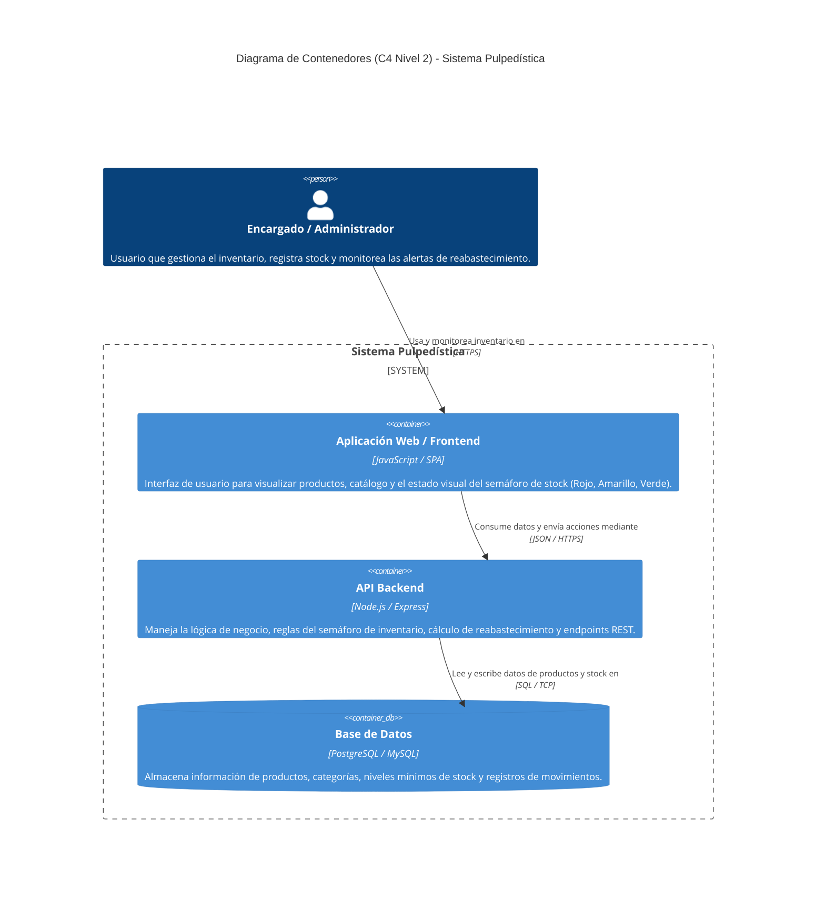

```mermaid
C4Context
    title Diagrama de Contenedores (C4 Nivel 2) - Sistema Pulpedística

    Person(usuario, "Encargado / Administrador", "Usuario que gestiona el inventario, registra stock y monitorea las alertas de reabastecimiento.")

    System_Boundary(pulpedistica, "Sistema Pulpedística") {
        Container(frontend, "Aplicación Web / Frontend", "JavaScript / SPA", "Interfaz de usuario para visualizar productos, catálogo y el estado visual del semáforo de stock (Rojo, Amarillo, Verde).")
        Container(api, "API Backend", "Node.js / Express", "Maneja la lógica de negocio, reglas del semáforo de inventario, cálculo de reabastecimiento y endpoints REST.")
        ContainerDb(db, "Base de Datos", "PostgreSQL / MySQL", "Almacena información de productos, categorías, niveles mínimos de stock y registros de movimientos.")
    }

    Rel(usuario, frontend, "Usa y monitorea inventario en", "HTTPS")
    Rel(frontend, api, "Consume datos y envía acciones mediante", "JSON / HTTPS")
    Rel(api, db, "Lee y escribe datos de productos y stock en", "SQL / TCP")
```
